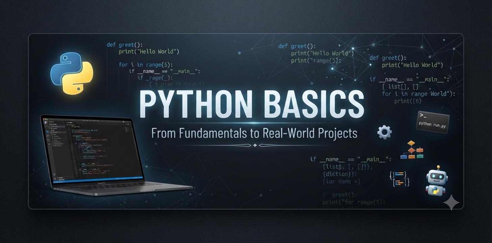
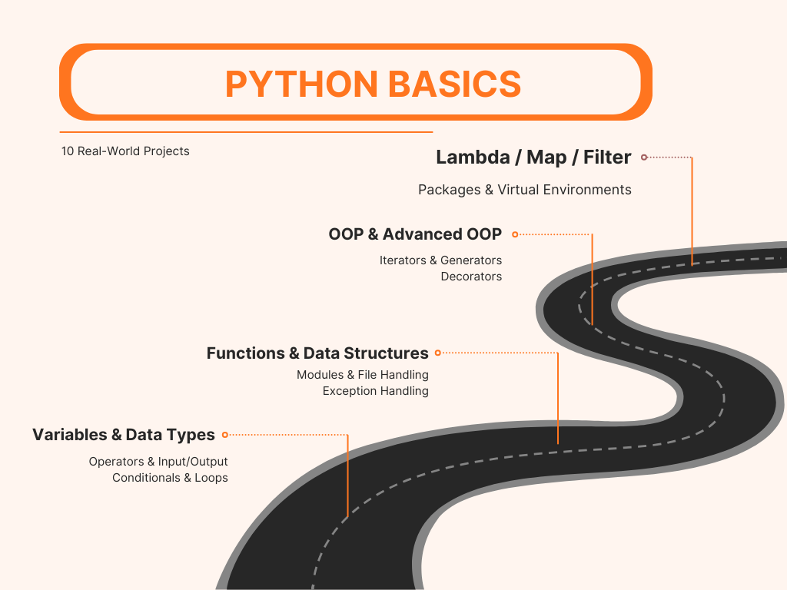
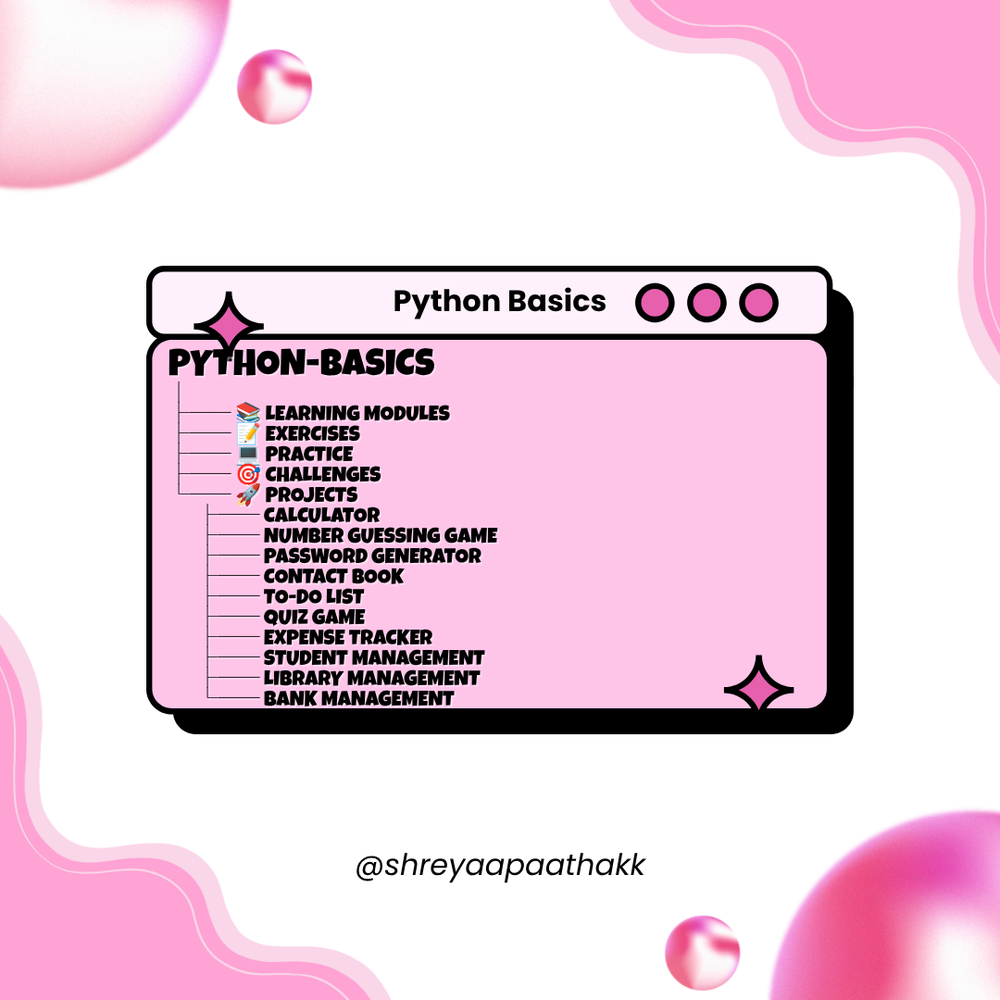

<p align="center">
  
</p>

# 🐍 Python Basics

Welcome to my **Python Basics** repository!

This beginner-friendly repository documents my journey of learning Python fundamentals from scratch. Each topic is organized into its own folder with examples, notes and mini projects.


## 📚 Topics Covered

<p align="center">
  
</p>

- Variables
- Data Types
- Operators
- User Input & Output
- Conditional Statements
- Loops
- Functions
- Lists
- Tuples
- Sets
- Dictionaries
- Strings
- File Handling
- Exception Handling
- Modules & Packages
- Object-Oriented Programming (OOP)


## Mini Projects

<p align="center">
  
</p>

- Calculator
- Number Guessing Game
- Password Generator
- To-Do List
- Expense Tracker

## Prerequisites

- Python 3.10+

## 📂 Repository Structure

```
python-basics/<br>
├── README.md<br>
├── .gitignore<br>
├── LICENSE<br>
├── requirements.txt<br>
├── 01_variables/<br>
│   └── variables.py<br>
│   └── notes.md<br>
├── 02_data_types/<br>
├── 03_operators/<br>
└── ...
```

## Tools Used

- Python 3
- Visual Studio Code
- Git
- GitHub

## ▶️ Running an Example

```bash
cd 07_functions
python functions.py
```

## Clone the Repository

```bash
git clone https://github.com/shreyaapaathakk/python-basics.git
cd python-basics
```


## 🎯 Goal

The goal of this repository is to:

- Learn Python fundamentals
- Practice writing clean code
- Build small projects
- Track my progress publicly on GitHub


## Contributing

Contributions are welcome!

## 🚀 Author

**Shreya Pathak**
